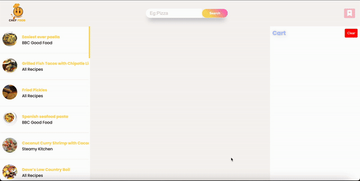

<h1> Recipe App</h1>

<h1> Project Features</h1>

Developed using HTML, SCSS, and JavaScript.
Achieved a modern and stylish design with the help of the Bootstrap library.
Dynamically fetched recipe names, photos, instructions, and website information of the recipe creator through API integration.
Quick search functionality to find any recipe you desire.
Favoriting and adding to the cart for a faster access to recipes.

<h1> Key Points About the Project</h1>

Easily add recipes to favorites.
Streamlined shopping experience by adding recipes to the cart.
The creator's name and website are displayed at the bottom, with a clickable link redirecting to the respective site.

<h1>Explore the Design</h1>

